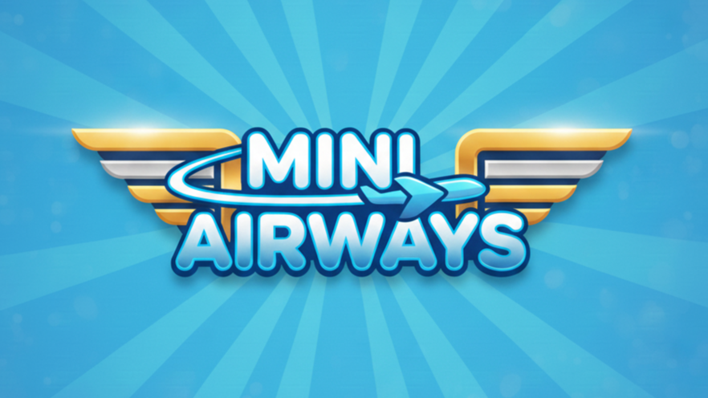

# Mini Airways

  

  <strong>Un videojuego de simulación y estrategia aérea desarrollado en Unity 6.2.</strong>

---

## 📝 Descripción

**Mini Airways** es un juego de gestión y estrategia inspirado en títulos como *Mini Motorways* y *Mini Metro*. En este desafío, asumes el rol de un gestor de tráfico aéreo cuyo objetivo principal es evitar el colapso de los aeropuertos ante una demanda de pasajeros en constante crecimiento.

El proyecto ha sido desarrollado como parte de la asignatura de **Paradigmas y Técnicas de Programación** en el grado de **iMAT (ICAI)**.

## 🎮 Jugabilidad y Mecánicas

- **Gestión de Vuelos:** Compra rutas y despliega aviones de tres tamaños (pequeño, mediano y grande).
- **Dificultad Progresiva:** La demanda y el número de aeropuertos crecen dinámicamente.
- **Economía:** Gana monedas transportando pasajeros y reinviértelas en mejoras.
- **Mejoras:** Aumenta la velocidad/capacidad de tus aviones y amplía la capacidad de los aeropuertos.

## 🛠️ Aspectos Técnicos

El desarrollo se apoya en conceptos avanzados de programación y algoritmos:

- **Algoritmo de Dijkstra:** Implementado para el cálculo automático de las rutas de vuelo más eficientes.
- **Patrones de Diseño:**
  - **Singleton:** Gestión centralizada de sistemas y factorías.
  - **Factoría:** Creación dinámica de diferentes tipos de aeronaves.
  - **Flyweight:** Optimización de recursos mediante el uso eficiente de Prefabs.
  - **Command:** Gestión desacoplada del sistema de entrada de usuario.
  - **Observer:** Notificaciones en tiempo real para aterrizajes y estados del juego.
  - **State:** Máquinas de estados para las distintas fases del juego.

## 👥 Autores

Este proyecto ha sido desarrollado por:

- **Alberto Prieto González** - [@prialgon](https://github.com/prialgon)
- **Álvaro Pérez Ortega** - [@Coolgolf1](https://github.com/Coolgolf1)  

---

Universidad Pontificia Comillas - ICAI

3º de Grado en Ingeniería Matemática e Inteligencia Artificial

